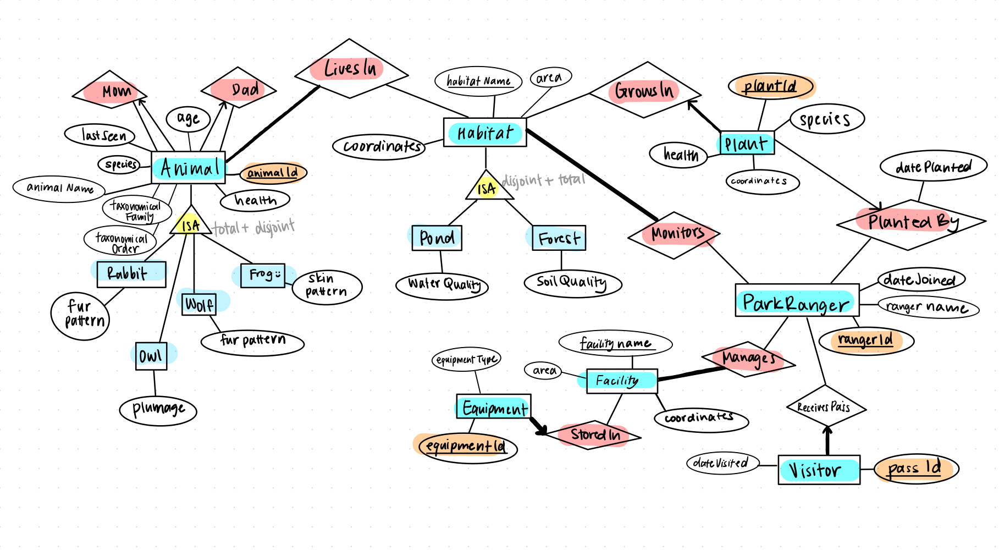
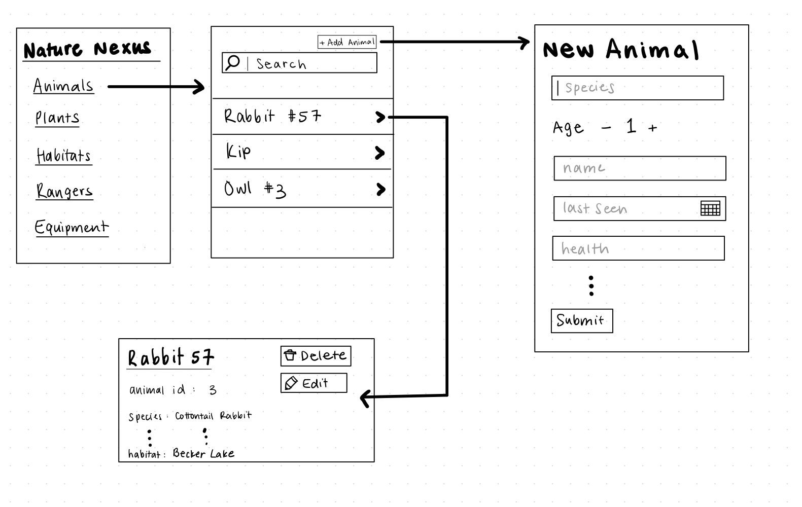

# NatureNexus

## Project Description:

### Summary:

Rangers Rejoice! Our project is an Ecosystem Management program used by national park managers/rangers to keep track of the flora/fauna in their park. Rangers can log specific animals into the database, model their familial relationships, identify them + their traits, and track their health. Rangers can use this database to log plants, record park equipment, track habitat health, and more.

### ER Diagram:

### Task Breakdown:
- **Backend**
    - Set up Oracle database
        - create tables, populate with data
        - Create a script to reset/populate with data (might be helpful for manual testing)
    - Create express backend
        - We can use npx express-generator --no-view
            - Nice template to start with
        - Create routes for getting entity lists, a specific entity data, as well as creating, deleting, updating, etc
    - Connect backend to frontend

- **Frontend**
    - Set up react app w/ vite
    - Create a basic component for showing list data from the backend
        - Create a button that will be used to create an entity
        - Search (on the frontend to start)
        - Entity filter
    - Create a basic component for showing a single entity data from the backend
        - Create a button to delete the entity
        - Allow updating entity values

### Task Assignment & Timeline:

1. Set up database - *Joel*
    - Create a script to reset/populate with data
    - Based off of Milestone 2. Make sure it follows  participation constraints
    - **Deadline: July 28th**
2. Create frontend template - *All of us*
    - Set up routing
        - /[entity name]
        - /[entity name]/:id
    - **Deadline: July 23rd**
3. Create backend template - *All of us*
    - Create routes for each entity
        - /[entity name]	
    - **Deadline: July 23rd**
4. Create components for viewing entities - *Cindy*
    - **Deadline: July 27th**
5. Create component for editing/adding entities - *Joel*
    - **Deadline: July 28th**
6. Create components for searching/listing entities - *Aiden*
    - **Deadline: July 27th**
7. Create GET endpoints for each entity - *Cindy*
    - **Deadline: July 27th**
8. Create POST endpoints for each entity - *Joel*
    - **Deadline: July 30th**
9. Create DELETE endpoints for each entity - *Aiden*
    - **Deadline: July 30th**
10. Link frontend/backend together
    - Display backend data in frontend - *Cindy*
        - **Deadline: August 3rd**
    - Connect Delete Entity button to backend - *Joel*
        - **Deadline: August 3rd**
    - Connect Create Edit Entity to backend - *Aiden*
        - **Deadline: August 2nd**
    - Connect Add Entity button to backend - *Aiden*
        - **Deadline: August 2nd**
11. Implement LivesIn filtering - *Cindy*
    - Create filtering button to backend
        - **Deadline: August 5th**

### UI Prototyping:

